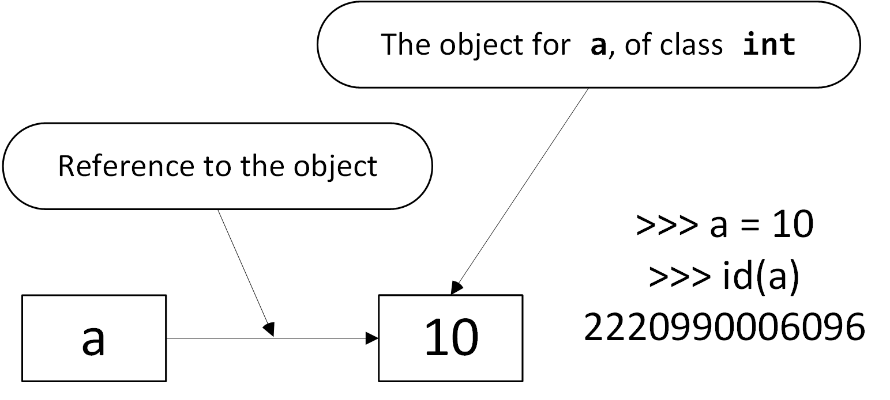
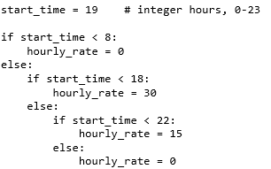

Corrections

# Errata

Corrections to the English VitalSource Bookshelf edition of *Programming in
Python Fundamentals*, sorted by section. Each
entry gives the section and print page number so you can jump straight to it in
Bookshelf, plus a severity tag - Serious (affects your code), Moderate (a figure
or explanation is wrong), or Minor (a typo). Spotted an error we have not listed
yet? Please email [frode.nasje@gmail.com](mailto:frode.nasje@gmail.com).

*Last updated: 22 August 2026*

| Section | Page | Severity | Reads | Should read |
|:-------:|:----:|:--------:|-------|-------------|
| 2.5.1 | 40 | Moderate | Figure: `a` points to the value 20. | Figure should show the state *before* `a` is reassigned - `a` points to 10. Correct figure below.  |
| 4.4 | 98 | Minor | "...it could of course have been any current." | "...it could of course have been any currency." |
| 4.4.3 | 105 | Serious | Wrong indentation in the code example. | Correct indentation in figure below.  |
{:.errata-table}
