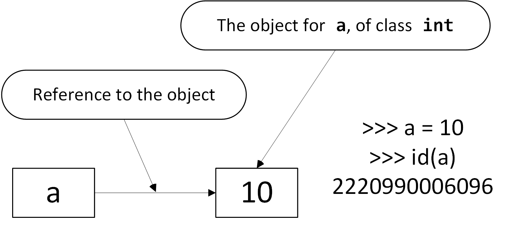
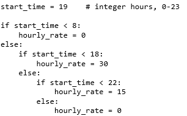
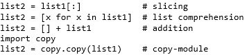

Corrections

# Errata

Corrections to the English VitalSource Bookshelf edition of *Programming in
Python Fundamentals*, sorted by section. Each
entry gives the section and print page number so you can jump straight to it in
Bookshelf, plus a severity tag - Serious (affects your code), Moderate (a figure
or explanation is wrong), or Minor (a typo). Spotted an error we have not listed
yet? Please email [frode.nasje@gmail.com](mailto:frode.nasje@gmail.com).

*Last updated: 14 Sep 2026*

| Section | Page | Severity | Reads | Should read |
|:-------:|:----:|:--------:|-------|-------------|
| 2.1 | 33 | Minor | `DateTime` | `datetime` |
| 2.5.1 | 40 | Moderate | Figure: `a` points to the value 20. | Figure should show the state *before* `a` is reassigned - `a` points to 10. Correct figure below.  |
| 2.5.2 | 41 | Minor | `comparison operator` | comparison operator (wrong font)|
| 4.4 | 98 | Minor | "...it could of course have been any current." | "...it could of course have been any currency." |
| 4.4.3 | 105 | Serious | Wrong indentation in the code example. | Correct indentation in figure below.  |
| 4.8 | 111 | Moderate | `match_day` | `match day` |
| 13 | 465 | Minor | tion | function |
| 5.11.2 | 139 | Minor | The code snippet showing ways to make shallow copy has a misleading comment (an import statement is misplaced) | Correct code below.  |
| 5.15.1 | 146 | Moderate | Omitted values default to `start → 0, stop → len(sequence), step → 1`. | These defaults apply left-to-right. With a negative step the direction flips: start defaults to the last index, stop goes past the beginning.|
| 5.15.1 | 147 | Moderate | The comment for this code snippet `print(s[None:])` is not precise | Correct comment should read:  <code>#"Helloworld" - None means "use the default # for this position": start defaults to 0 here</code> |
| 6.12.1 | 188 | Moderate | The numbered list gives the LEGB scopes in the wrong order, and the Local entry is imprecise. | 1. Local (L): names defined inside the current function. 2. Enclosing (E): names defined in enclosing functions when functions are nested. 3. Global (G): names defined at module level. 4. Built-in (B): names provided by Python, such as print, len, and type. |
| 7.5 | 231 | Minor | `# Counter({'h': 3, 'i': 2, '': 1})` | `# Counter({'h': 3, 'i': 2,})` |
| 13.3.1 | 463 | Minor | "after the colon is ed" | "after the colon is returned" |
{:.errata-table}